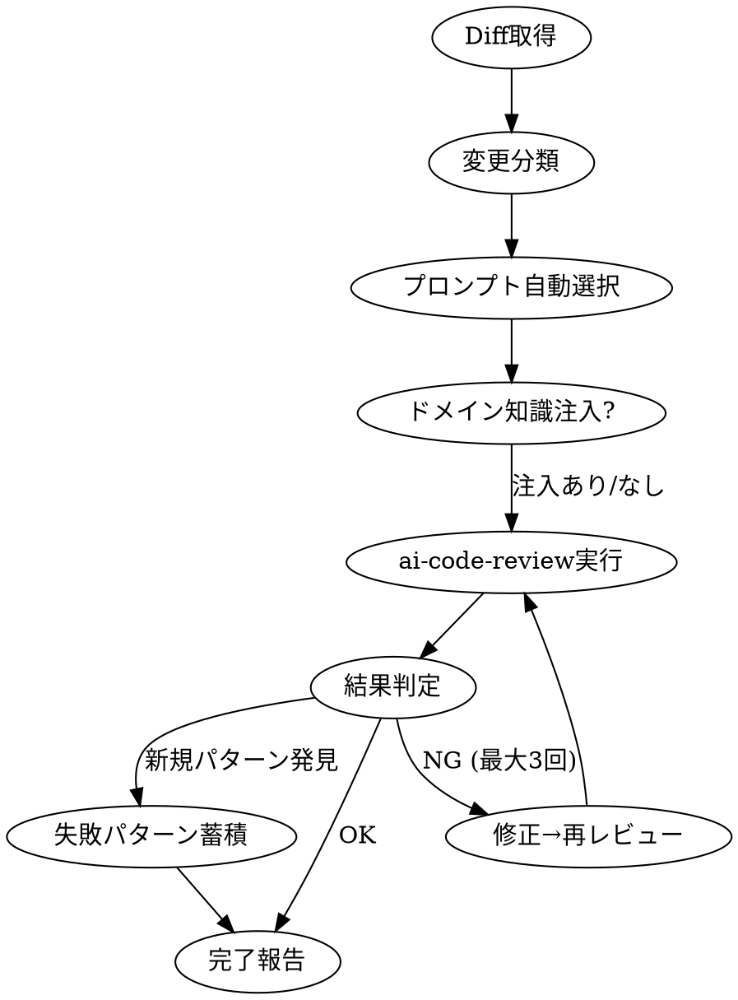

# Unified Review Orchestrator

ai-code-review CLIをエンジンとし、diff内容に応じたプロンプト自動選択・ドメイン知識注入・失敗パターン蓄積を行うレビューオーケストレータ。

## Relationship to Existing Tools

| Tool | Role after unification |
|------|----------------------|
| **ai-code-review** (CLI) | 分析エンジン。このスキルが呼び出す |
| **gstack/review** | gstackリポジトリ専用のPRレビュー。gstack以外ではこのスキルを使う |
| **verification-depth-check** | テスト検証の番犬。このスキルとは独立して発火し続ける |
| **myclaude-do code-reviewer** | feature-dev Phase 4のサブエージェント。このスキルの対象外 |

## When to Use

- コード変更後のCLAUDE.md検証ループ（`cargo run --bin review`）
- PRレビュー依頼（gstackリポジトリ以外）
- `レビュー` `コードレビュー` `PR` `diff` `review` で明示的に呼ばれたとき

## Workflow



## Step 1: Diff取得

```bash
# PR/ブランチレビュー
git diff origin/main...HEAD

# CLAUDE.md検証ループ（直近の変更）
git diff          # unstaged
git diff --cached # staged
```

diffが空なら終了。

## Step 2: 変更分類 → プロンプト自動選択

diffの内容をスキャンし、最適なプロンプトを決定する。

| 検出パターン | プロンプト | 理由 |
|---|---|---|
| `auth`, `crypto`, `secret`, `password`, `token`, `session`, `hash`, `encrypt` がファイル名またはdiffに含まれる | `--prompt security` | セキュリティ変更 |
| 新モジュール追加、`mod.rs`/`lib.rs`変更、trait/interface定義変更、Cargo.toml依存追加 | `--prompt architecture` | 構造変更 |
| 5ファイル以上 or 200行以上の変更 | `--prompt multi` | 広範な変更は並列レビュー |
| 単一ファイル20行以下の修正 | `--prompt quick` | 小さな修正 |
| 上記いずれにも該当しない | `--prompt default` | 標準レビュー |

**判定ロジック（Bash）:**

```bash
DIFF=$(git diff --stat HEAD 2>/dev/null || git diff --stat)
FILES_CHANGED=$(echo "$DIFF" | grep -c '|')
LINES_CHANGED=$(echo "$DIFF" | tail -1 | grep -oP '\d+(?= insertion)' || echo 0)

FULL_DIFF=$(git diff HEAD 2>/dev/null || git diff)

# Security check
if echo "$FULL_DIFF" | grep -qiP '(auth|crypto|secret|password|token|session|hash|encrypt)'; then
  PROMPT="security"
# Architecture check
elif echo "$FULL_DIFF" | grep -qP '(^[\+].*mod\s|^[\+].*trait\s|^[\+].*impl\s.*for\s|^\+\[dependencies\])'; then
  PROMPT="architecture"
# Large change
elif [ "$FILES_CHANGED" -ge 5 ] || [ "$LINES_CHANGED" -ge 200 ]; then
  PROMPT="multi"
# Small change
elif [ "$FILES_CHANGED" -le 1 ] && [ "$LINES_CHANGED" -le 20 ]; then
  PROMPT="quick"
else
  PROMPT="default"
fi
```

**手動オーバーライド:** ユーザーが明示的にプロンプトを指定した場合はそちらを優先。

## Step 3: ドメイン知識注入（パスベース自動選択）

変更ファイルのパスから、関連するknown-issuesだけを選択して注入する。
関係ないドメインの知識は渡さない。判断がつかないときは何も渡さない。

### known-issues frontmatter形式

各 `known-issues/<domain>.md` の先頭にYAML frontmatterで `paths` フィールドを持つ:

```yaml
---
paths:
  - "src/apprt/winui3/**"
  - "**/*com*.zig"
---
```

`paths` はglobパターンの配列。変更ファイルのいずれかがパターンにマッチすればそのmdファイルを選択する。
`paths` フィールドがないmdファイルは選択されない。

### マッチングロジック

```bash
KNOWN_ISSUES_DIR=~/.claude/skills/unified-review/known-issues
CHANGED_FILES=$(git diff --name-only HEAD 2>/dev/null || git diff --name-only)

[ -z "$CHANGED_FILES" ] && exit 0

CONTEXT_FILE=$(mktemp)
MATCHED=0

glob_to_regex() {
  echo "$1" | sed -e 's/\./\\./g' -e 's/\*\*/.*/g' -e 's/\*/[^\/]*/g' -e 's/?/[^\/]/g'
}

for md in "$KNOWN_ISSUES_DIR"/*.md; do
  [ "$(basename "$md")" = "README.md" ] && continue

  # frontmatterからpathsを抽出
  PATTERNS=$(sed -n '/^---$/,/^---$/p' "$md" | grep '^ *- ' | sed 's/^ *- *["\x27]\(.*\)["\x27]/\1/')
  [ -z "$PATTERNS" ] && continue

  MATCH_FOUND=0
  while IFS= read -r pattern; do
    [ -z "$pattern" ] && continue
    REGEX=$(glob_to_regex "$pattern")
    if echo "$CHANGED_FILES" | grep -qP "^${REGEX}$"; then
      MATCH_FOUND=1
      break
    fi
  done <<< "$PATTERNS"

  if [ "$MATCH_FOUND" -eq 1 ]; then
    # frontmatter除去して本文だけ追記
    sed '1{/^---$/!q;};1,/^---$/d' "$md" >> "$CONTEXT_FILE"
    echo "" >> "$CONTEXT_FILE"
    MATCHED=$((MATCHED + 1))
  fi
done

if [ "$MATCHED" -gt 0 ]; then
  export REVIEW_EXTRA_CONTEXT="$CONTEXT_FILE"
fi
# マッチなし → REVIEW_EXTRA_CONTEXT未設定 → 一般レビューのみ（ノイズゼロ）
```

### 設計判断

- **関係ないドメイン知識は害**: vtableの話をDXFモジュールのレビューに注入しても意味がない
- **判断がつかないときは注入しない**: false negativeよりfalse positiveの方が有害
- **パスがカバーしきれないケース**（共通ユーティリティ変更等）は一般レビューに任せる

## Step 4: ai-code-review実行

```bash
# diff全体レビュー
cargo run --manifest-path ~/ai-code-review/Cargo.toml \
  --bin review -- --diff --target . --prompt $PROMPT --context

# 単一ファイルレビュー
cargo run --manifest-path ~/ai-code-review/Cargo.toml \
  --bin review -- <file> --prompt $PROMPT
```

バックエンドはデフォルトgemini。大規模変更(multi)はclaudeも併用を検討。

## Step 5: 結果判定と修正ループ

CLAUDE.md準拠の検証ループ:

1. レビュー結果に `🚨` または `⚠` があればNG
2. NG → 自分で修正 → 再レビュー
3. 最大3回繰り返してもNGなら、ユーザーに状況を報告
4. OK（`✓` のみ）なら完了

## Step 6: 失敗パターン蓄積（フィードバックループ）

レビューで発見した問題が**再発防止すべきパターン**なら、`known-issues/` に追加する。

### 蓄積基準

- 同じ種類の問題が2回以上発生した
- プロジェクト固有の落とし穴（一般的なコーディングミスではない）
- 既知バグパターンとして検出可能な具体的なコードパターンがある

### ファイル形式

```markdown
# known-issues/<domain>.md

## <パターン名>
- **検出条件:** <grepで引っかかるパターン or コード構造>
- **問題:** <何が起きるか>
- **正しい対処:** <どうすべきか>
- **発見日:** <YYYY-MM-DD>
- **発生元:** <どのレビューで見つかったか>
```

### 蓄積フロー

```
レビューで問題発見
  ↓
「これは再発しうるか？」を判断
  ↓ Yes
known-issues/<domain>.md に追記
  ↓
次回レビュー時にStep 3で自動注入
```

## Quick Reference

```bash
# 自動プロンプト選択でdiffレビュー (このスキルが自動で行う)

# 手動で特定プロンプト指定
cargo run --manifest-path ~/ai-code-review/Cargo.toml \
  --bin review -- --diff --target . --prompt security

# 利用可能プロンプト
# default, quick, security, architecture, holistic, principles, multi

# known-issues一覧
ls ~/.claude/skills/unified-review/known-issues/
```
